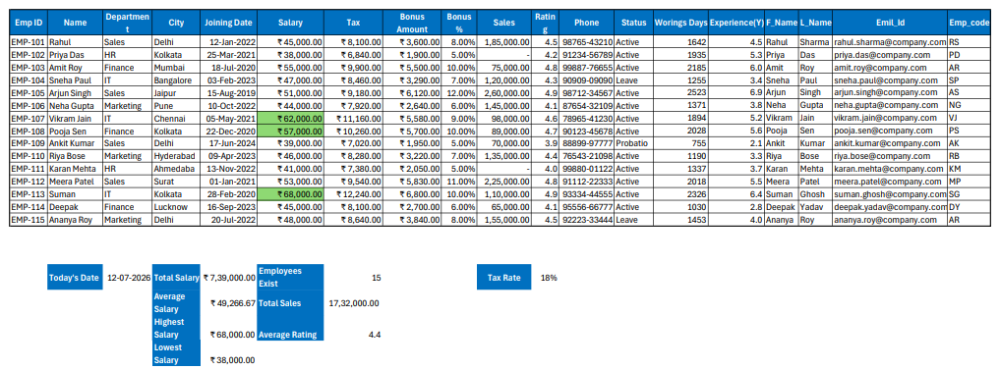

# Excel Fundamentals Practice

## Objective

Practice the core Excel features required for spreadsheet management and data analysis.

---

## Dataset

Employee Sales Data

15 Employees

11 Columns

---

## Topics Covered

- Workbook & Worksheet
- Cell CRUD
- Formatting
- Number Formatting
- Custom Formatting
- SUM
- AVERAGE
- MIN
- MAX
- COUNT
- Relative References
- Absolute References
- Mixed References
- Flash Fill
- Freeze Panes
- Page Layout
- Data Validation

---

## Screenshot

---

## Skills Practiced

- Data Entry
- Cell Formatting
- Formula Writing
- Date Handling
- Keyboard Navigation
- Spreadsheet Organization

---

## Workbook

Employee_Sales_2026.xlsx
